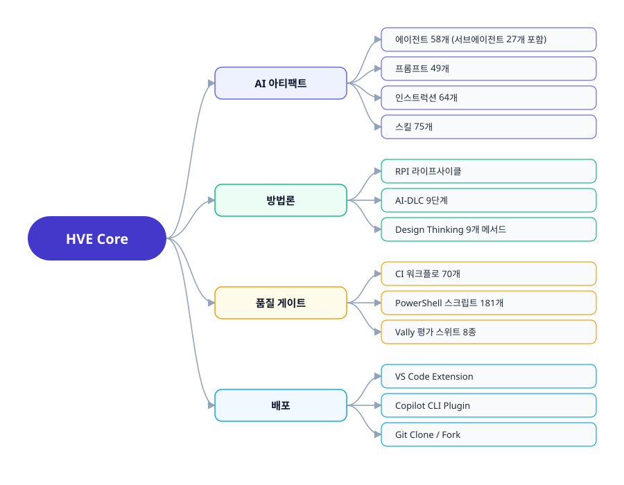
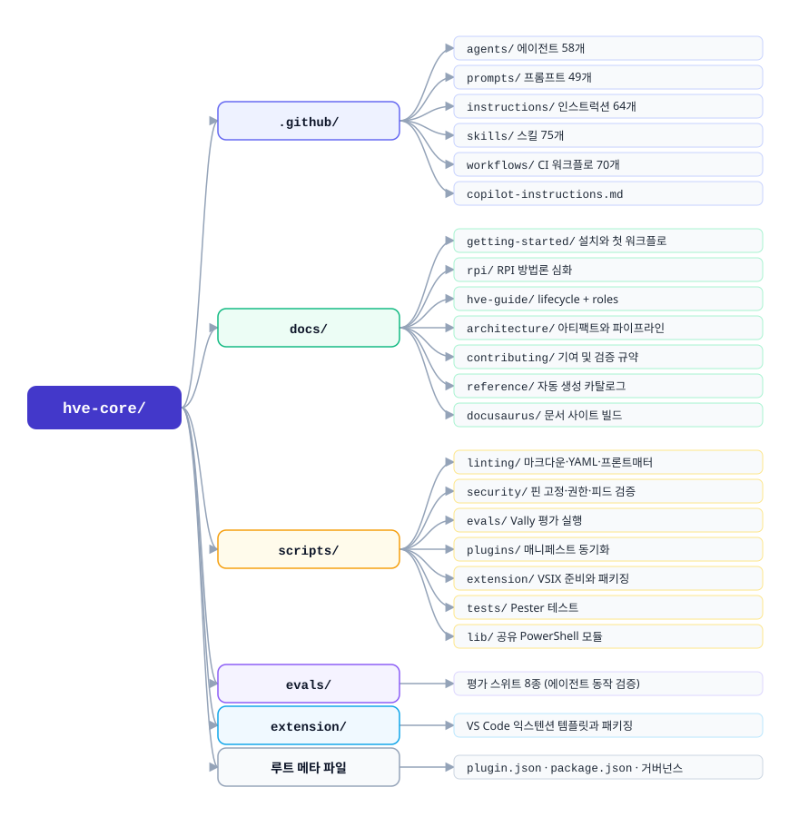
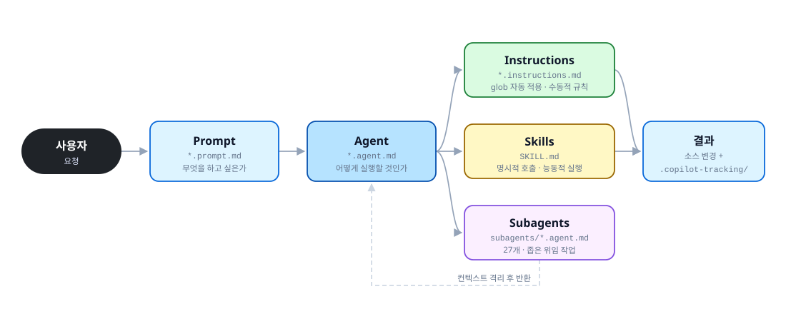
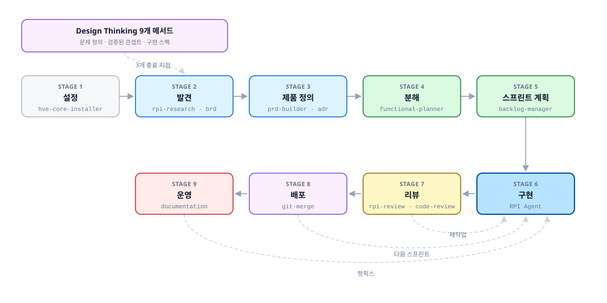
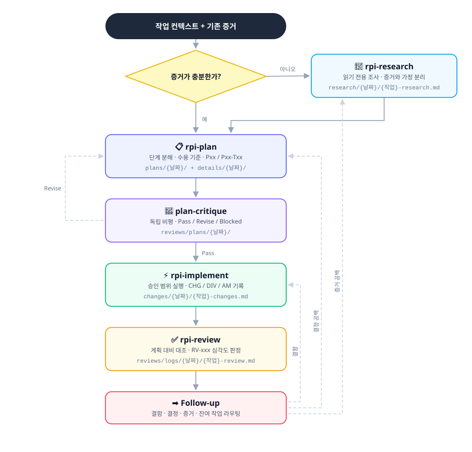
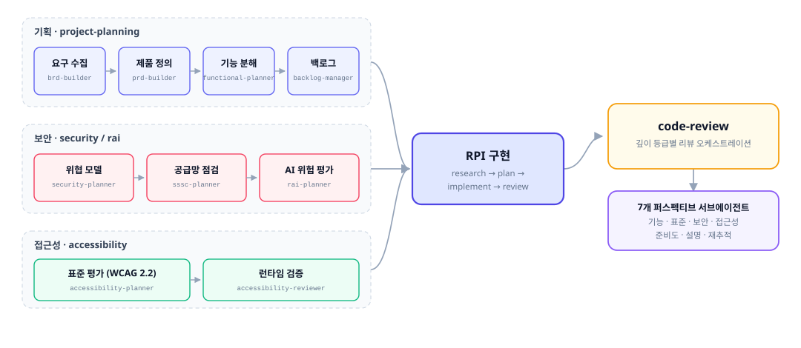
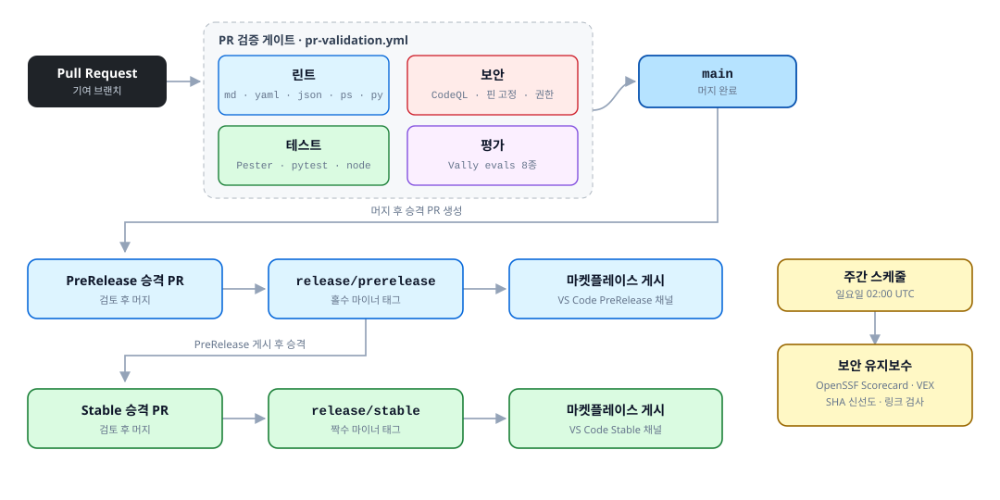
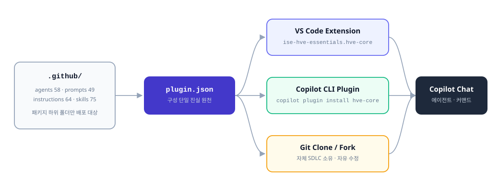
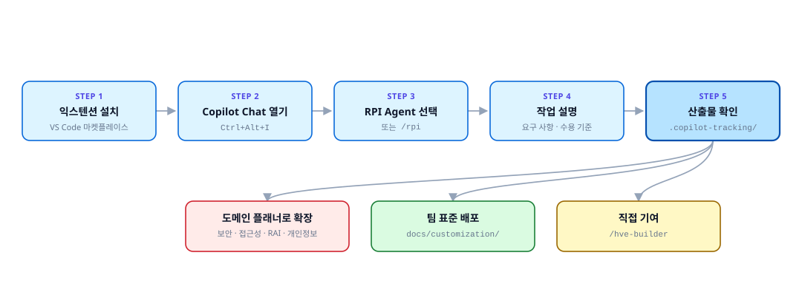

# HVE Core 구조 브리핑

[microsoft/hve-core](https://github.com/microsoft/hve-core) 저장소의 전체 구조를 처음 보는 사람도 따라갈 수 있게 정리한 한국어 브리핑입니다. 무엇이 어디에 있고, 어떤 흐름으로 동작하며, 어떤 검증과 배포 경로를 거치는지 다이어그램 중심으로 설명합니다.

> **📊 Quick Overview 슬라이드: <https://daeungo1.github.io/Github-Copilot-HVE-Core-brief/>**
>
> 17장 구성이며 진행 타이머, 스피커 노트(<kbd>N</kbd>), 목차(<kbd>O</kbd>), 다크 모드를 지원합니다. 이 README는 같은 내용의 상세 문서 버전입니다.

> 이 저장소는 원본 코드를 포함하지 않는 **설명 문서 전용** 저장소입니다. 실제 아티팩트와 스크립트는 [microsoft/hve-core](https://github.com/microsoft/hve-core)에 있습니다.
> 수치는 2026-09-02 기준 `main` 스냅샷입니다.

## 1. HVE Core 한눈에 보기

HVE Core는 GitHub Copilot을 "반복 가능하고 표준에 맞는" 방식으로 쓰기 위한
에이전틱 SDLC 프레임워크입니다. 코드 라이브러리가 아니라 **AI 워크플로 자산의
집합**이라는 점이 핵심입니다.

| 구분              | 규모        | 위치                     | 역할                                    |
|-------------------|-------------|--------------------------|-----------------------------------------|
| 에이전트          | 58개        | `.github/agents/`        | 다단계 작업 오케스트레이션              |
| 서브에이전트      | 27개        | `.github/agents/**/subagents/` | 부모 에이전트가 위임하는 좁은 작업 |
| 프롬프트          | 49개        | `.github/prompts/`       | 워크플로 진입점(슬래시 커맨드)          |
| 인스트럭션        | 64개        | `.github/instructions/`  | glob 기반 자동 적용 표준                |
| 스킬              | 75개        | `.github/skills/`        | 실행 가능한 도메인 지식 및 스크립트     |
| CI 워크플로       | 70개        | `.github/workflows/`     | 검증, 보안 스캔, 릴리스 자동화          |
| 자동화 스크립트   | 181개(ps1)  | `scripts/`               | 린트, 검증, 패키징, 평가                |
| 문서              | 429개(md)   | `docs/`                  | Docusaurus 사이트 원본                  |

> [!NOTE]
> HVE Core는 빠르게 변화하는 실험적 프레임워크입니다. 프로덕션 의존성보다는
> **패턴과 학습의 원천**으로 다루는 것이 저장소가 권고하는 사용법입니다.

## 2. 저장소 최상위 구조

## 3. AI 아티팩트 4계층 모델

HVE Core의 가장 중요한 개념입니다. 사용자 요청은 프롬프트에서 출발해 에이전트로
위임되고, 에이전트는 인스트럭션(표준)과 스킬(실행 능력)을 끌어와 작업을 수행합니다.

| 계층             | 파일 패턴            | 활성화 방식                      | 성격                    |
|------------------|----------------------|----------------------------------|-------------------------|
| Prompt           | `*.prompt.md`        | 슬래시 커맨드(`/rpi`)            | 단일 세션 진입점        |
| Agent            | `*.agent.md`         | 에이전트 선택기 또는 프롬프트    | 도구 접근 + 오케스트레이션 |
| Instructions     | `*.instructions.md`  | `applyTo:` glob 자동 매칭        | 수동적 참조 표준        |
| Skill            | `SKILL.md`           | 명시적 호출                      | 능동적 실행 능력        |

핵심 구분은 다음과 같습니다.

* 인스트럭션은 "규칙"을 제공하고, 스킬은 "행동"을 제공합니다.
* 인스트럭션은 파일 경로 매칭으로 자동 적용되고, 스킬은 필요할 때 로드됩니다.
* 서브에이전트는 부모의 컨텍스트를 오염시키지 않도록 별도 세션에서 실행됩니다.

> [!IMPORTANT]
> `.github/instructions/` 최상위(패키지 하위 폴더 없음)에 놓인 파일은
> **저장소 전용**이며 플러그인/익스텐션에 배포되지 않습니다. 배포 대상은
> `hve-core/`, `security/`, `shared/` 같은 패키지 하위 폴더에 있는 파일입니다.

## 4. AI-DLC: 9단계 라이프사이클

`docs/hve-guide/lifecycle/`가 정의하는, HVE Core가 지원하는 AI 지원 프로젝트
라이프사이클입니다. 각 단계마다 담당 에이전트와 스킬이 매핑됩니다.

| 단계 | 이름               | 대표 도구                                                    |
|------|--------------------|--------------------------------------------------------------|
| 1    | Setup              | `hve-core-installer`, `/git-setup`                           |
| 2    | Discovery          | `rpi-research`, `brd-builder`, security/sssc/rai planner      |
| 3    | Product Definition | `prd-builder`, `requirements-author`, `adr-creation`          |
| 4    | Decomposition      | `functional-planner`, `backlog-manager`                       |
| 5    | Sprint Planning    | `backlog-manager`, `backlog-management`                       |
| 6    | Implementation     | `RPI Agent`, `rpi-plan`, `rpi-implement`, `hve-builder`       |
| 7    | Review             | `rpi-review`, `code-review`, `hve-builder`                    |
| 8    | Delivery           | `/git-merge`, `/ado-get-build-info`                           |
| 9    | Operations         | `documentation`, `hve-builder`                                |

역할별 진입 가이드는 `docs/hve-guide/roles/`에 있습니다(엔지니어, 테크리드, TPM,
보안 아키텍트, 데이터 사이언티스트, UX 디자이너, SRE 등 10종).

## 5. RPI: 핵심 실행 방법론

RPI(Research, Plan, Implement, Review)는 6단계 구현 작업의 실제 엔진입니다.
"AI가 구현할 수 없다는 것을 알면, 그럴듯한 코드 대신 검증된 사실을 추구한다"는
전제에서 출발해 단계를 분리합니다.

산출물은 모두 `.copilot-tracking/`(gitignore 대상) 아래 날짜별로 쌓입니다.

| 단계      | 산출물 경로                                             | 식별자    |
|-----------|---------------------------------------------------------|-----------|
| Research  | `.copilot-tracking/research/{YYYY-MM-DD}/`              | 없음      |
| Plan      | `.copilot-tracking/plans/`, `details/`                  | `Pxx`, `Pxx-Txx` |
| Critique  | `.copilot-tracking/reviews/plans/`                      | 처분 상태 |
| Implement | `.copilot-tracking/changes/`                            | `CHG-xxx`, `DIV-xxx`, `AM-xxx` |
| Review    | `.copilot-tracking/reviews/logs/`                       | `RV-xxx`  |

진입 방법은 세 가지입니다.

* `RPI Agent` 선택: 라이프사이클 전체를 감싸는 사용자 선택형 래퍼
* `/rpi-quick`: 스킬 기반 전체 흐름 진입점
* 개별 스킬(`/rpi-research`, `/rpi-plan`, `/rpi-implement`, `/rpi-review`,
  `/rpi-walkthrough`, `/rpi-challenger`): 다음 행동이 명확할 때 최소 진입

## 6. 도메인 패키지 지도

아티팩트는 도메인 패키지 단위로 나뉘어 있고, 4계층이 같은 패키지 이름을
공유합니다. 아래 표가 저장소 전체의 "무게 중심"을 보여줍니다.

| 패키지                     | 에이전트 | 프롬프트 | 인스트럭션 | 스킬 | 초점                                        |
|----------------------------|----------|----------|------------|------|---------------------------------------------|
| `project-planning`         | 14       | 0        | 7          | 15   | BRD/PRD, ADR, 백로그, 실험 설계             |
| `security`                 | 10       | 15       | 6          | 13   | OWASP 전 시리즈, STRIDE, 공급망, VEX        |
| `coding-standards`         | 9        | 0        | 14         | 2    | 코드 리뷰 퍼스펙티브, 언어별 규약           |
| `hve-core`                 | 6        | 11       | 8          | 9    | RPI 에이전트, 문서화, 프롬프트 빌더         |
| `accessibility`            | 4        | 1        | 2          | 1    | WCAG 2.2, ARIA, Section 508, EN 301 549     |
| `rai` / `rai-planning`     | 3        | 3        | 2          | 1    | NIST AI RMF, EU AI Act, AI STRIDE           |
| `experimental`             | 3        | 2        | 10         | 9    | Mural, PowerPoint, 영상, TTS                |
| `design-thinking`          | 2        | 15       | 1          | 6    | 9개 DT 메서드, UX 아티팩트, 코칭            |
| `privacy`                  | 2        | 0        | 1          | 0    | DPIA, 데이터 맵, 개인정보 통제              |
| `data-science-engineering` | 1        | 1        | 0          | 7    | 데이터 카탈로그, 실험, 모델링               |
| `rpi`                      | 0        | 0        | 0          | 8    | 리서치/계획/구현/리뷰/워크스루 스킬         |
| `shared`                   | 0        | 0        | 7          | 3    | 텔레메트리, 백로그 템플릿, 신뢰 경계        |
| `installer`                | 0        | 0        | 0          | 1    | HVE Core 설치 워크플로                      |
| 저장소 전용(루트)          | 4        | 1        | 6          | 0    | 이 저장소에만 적용, 배포 제외               |
| **합계**                   | **58**   | **49**   | **64**     | **75** |                                           |

### 대표 워크플로 예시

## 7. scripts/: 자동화 계층

`scripts/`는 181개의 PowerShell 스크립트와 Python 유틸리티로 구성된 검증
엔진입니다. 모든 스크립트는 `npm run` 스크립트로 감싸져 있습니다.

| 디렉터리              | 책임                                                     |
|-----------------------|----------------------------------------------------------|
| `scripts/linting/`    | 마크다운, YAML, JSON, 프론트매터, 링크, 모델 참조 검증   |
| `scripts/security/`   | 의존성 SHA 핀 고정, 워크플로 권한, 공개 피드 검증        |
| `scripts/evals/`      | Vally 기반 에이전트 동작 평가 실행 및 대시보드           |
| `scripts/plugins/`    | `plugin.json` 매니페스트 동기화 및 드리프트 검사         |
| `scripts/extension/`  | VS Code 익스텐션 준비 및 패키징                          |
| `scripts/docs/`       | `docs/reference/` 자동 생성                              |
| `scripts/devcontainer/` | 락파일 무결성 검증                                     |
| `scripts/tests/`      | Pester 테스트(소스 구조를 미러링)                        |
| `scripts/lib/`        | 공유 PowerShell 모듈                                     |

### 자주 쓰는 명령

| 명령                             | 용도                                        |
|----------------------------------|---------------------------------------------|
| `npm run validate:local`         | 로컬 안전 검증 전체 집합 실행               |
| `npm run lint:md` / `lint:md:fix` | 마크다운 린트 및 자동 수정                 |
| `npm run lint:tables` / `format:tables` | 표 정렬 확인 및 정렬               |
| `npm run validate:skills`        | 스킬 구조 및 Python 설정 검증               |
| `npm run test:ps`                | Pester 테스트(결과는 `logs/`에 기록)        |
| `npm run plugin:sync`            | 아티팩트 추가/이동 후 매니페스트 갱신       |
| `npm run docs:generate`          | `docs/reference/` 페이지 재생성             |

> [!TIP]
> PowerShell 테스트는 항상 `npm run test:ps`로만 실행합니다. 결과 요약은
> `logs/pester-summary.json`, 실패 상세는 `logs/pester-failures.json`에 남습니다.

## 8. 품질 게이트와 CI 파이프라인

70개 워크플로가 PR 검증, 보안 스캔, 릴리스 사다리를 담당합니다.

### evals/: 에이전트 동작 평가

문서와 스크립트만으로는 프롬프트 품질을 보장할 수 없기 때문에, HVE Core는
Vally CLI 기반 평가 스위트를 별도로 둡니다.

| 스위트                  | 검증 대상                                    |
|-------------------------|----------------------------------------------|
| `skill-quality`         | 스킬 설명 및 활성화 품질                     |
| `skill-hygiene`         | 스킬 구조 위생                               |
| `agent-behavior`        | 에이전트 동작 일관성                         |
| `agent-conformance`     | 플래너 에이전트 6종의 단계 준수              |
| `behavior-conformance`  | 프롬프트/인스트럭션/스킬 동작 준수           |
| `baseline-equivalence`  | 커스터마이즈 전후 동등성                     |
| `script-validation`     | 스크립트 계약 검증                           |

## 9. 배포 채널

같은 아티팩트 집합이 세 가지 경로로 배포됩니다. 구성 목록의 단일 진실 원천은
루트 `plugin.json`입니다.

| 채널               | 대상                       | 갱신 방식                             |
|--------------------|----------------------------|---------------------------------------|
| VS Code Extension  | 개별 개발자, 팀 표준 배포  | 마켓플레이스 자동 업데이트            |
| Copilot CLI Plugin | 터미널 중심 워크플로       | `copilot plugin install hve-core`     |
| Git Clone / Fork   | 자체 SDLC를 소유하려는 팀  | 수동 동기화, 자유로운 수정            |

릴리스 채널은 `main` → `release/prerelease`(홀수 마이너) →
`release/stable`(짝수 마이너) 순서로 승격됩니다.

## 10. 처음 시작하기

원본 저장소에 기여할 때의 최소 절차는 다음과 같습니다.

1. 아티팩트를 추가하거나 이동한 뒤 `npm run plugin:sync`를 실행합니다.
2. `npm run docs:generate`로 `docs/reference/` 페이지를 갱신합니다.
3. `npm run validate:local`로 로컬 검증을 통과시킵니다.
4. 커밋 메시지 스코프는 디렉터리와 일치시킵니다(`(agents)`, `(skills)`,
   `(scripts)`, `(docs)` 등).

## 11. 더 읽을 문서

모두 [microsoft/hve-core](https://github.com/microsoft/hve-core) 원본 저장소 링크입니다.

| 주제                 | 링크                                                                                                       |
|----------------------|------------------------------------------------------------------------------------------------------------|
| 문서 사이트          | <https://microsoft.github.io/hve-core/>                                                                    |
| 시작 가이드          | [docs/getting-started](https://github.com/microsoft/hve-core/blob/main/docs/getting-started/README.md)      |
| RPI 워크플로 심화    | [docs/rpi](https://github.com/microsoft/hve-core/blob/main/docs/rpi/README.md)                             |
| 라이프사이클 9단계   | [docs/hve-guide/lifecycle](https://github.com/microsoft/hve-core/blob/main/docs/hve-guide/lifecycle/README.md) |
| 역할별 가이드        | [docs/hve-guide/roles](https://github.com/microsoft/hve-core/blob/main/docs/hve-guide/roles/README.md)      |
| AI 아티팩트 아키텍처 | [docs/architecture/ai-artifacts.md](https://github.com/microsoft/hve-core/blob/main/docs/architecture/ai-artifacts.md) |
| CI/CD 워크플로 구조  | [docs/architecture/workflows.md](https://github.com/microsoft/hve-core/blob/main/docs/architecture/workflows.md) |
| Design Thinking      | [docs/design-thinking](https://github.com/microsoft/hve-core/blob/main/docs/design-thinking/README.md)      |
| 기여 가이드          | [CONTRIBUTING.md](https://github.com/microsoft/hve-core/blob/main/CONTRIBUTING.md)                          |
| 포크 및 확장         | [docs/customization/forking.md](https://github.com/microsoft/hve-core/blob/main/docs/customization/forking.md) |

## 출처와 라이선스

이 저장소의 브리핑 문서와 다이어그램은 [microsoft/hve-core](https://github.com/microsoft/hve-core)를 분석해 작성한 2차 저작물입니다. 원본은 MIT 라이선스이며 저작권은 Microsoft Corporation에 있습니다. 자세한 내용은 [LICENSE](LICENSE)와 [NOTICE](NOTICE)를 참고하세요.

원본 저장소 일부 스킬 콘텐츠는 OWASP Foundation 발행물에서 파생되어 CC BY-SA 4.0이 적용됩니다. 해당 범위는 원본의 [THIRD-PARTY-NOTICES](https://github.com/microsoft/hve-core/blob/main/THIRD-PARTY-NOTICES)에 정리되어 있습니다.

이 저장소는 Microsoft의 공식 배포물이 아니며, 개인이 학습 목적으로 정리한 요약본입니다.
